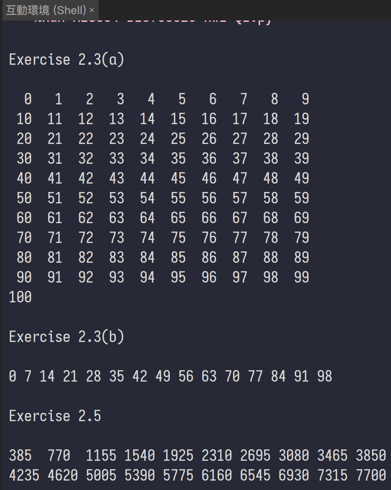
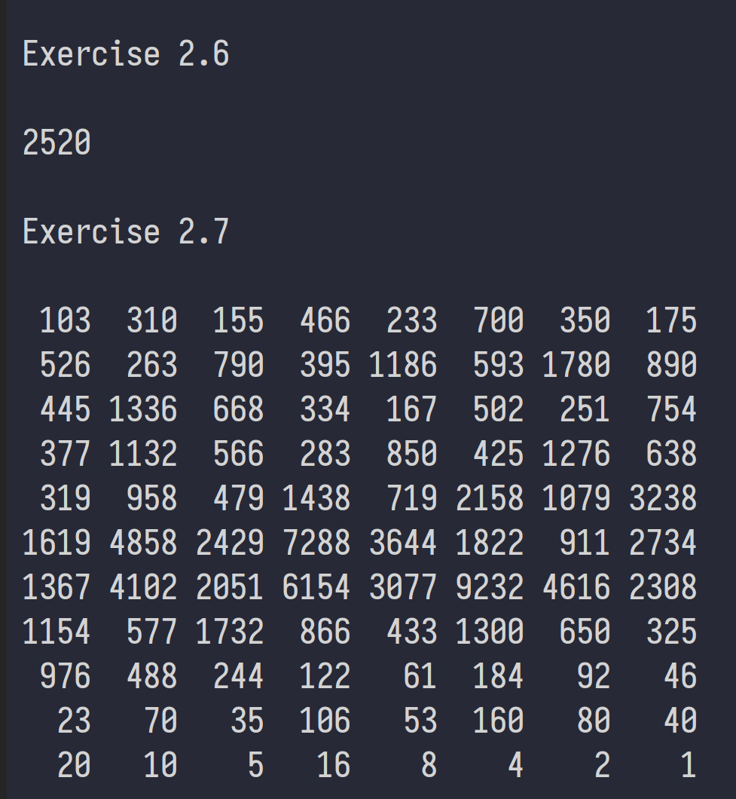
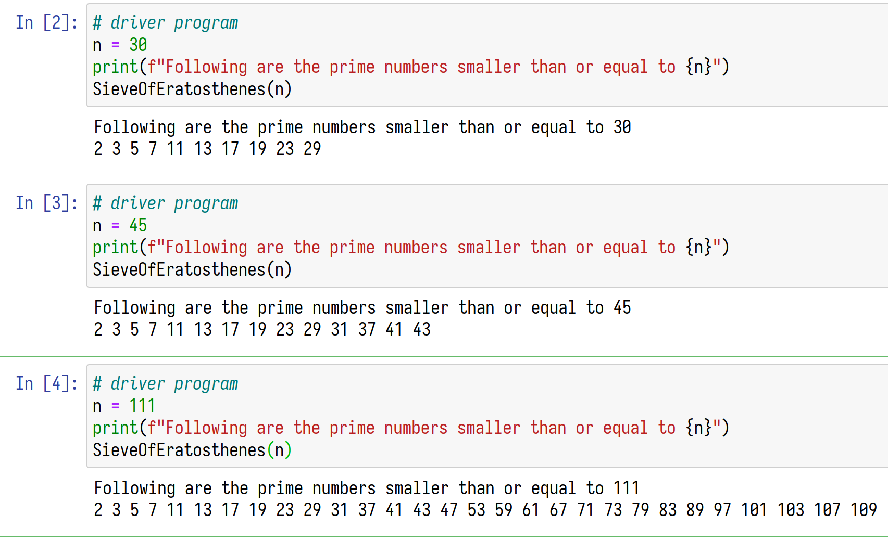
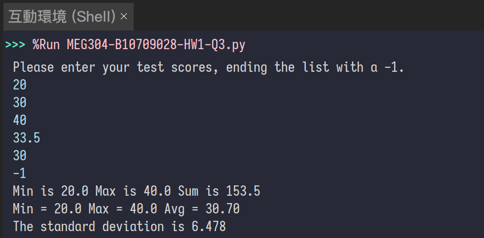
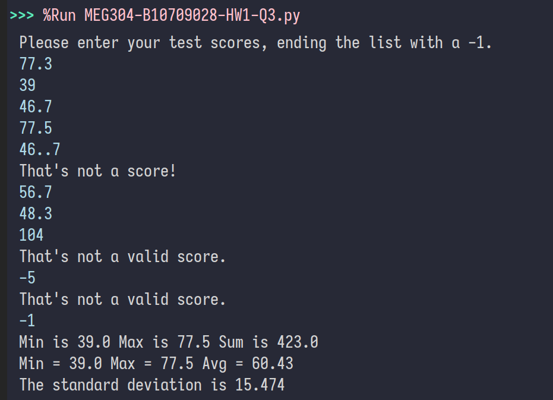
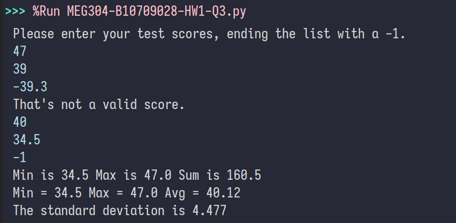
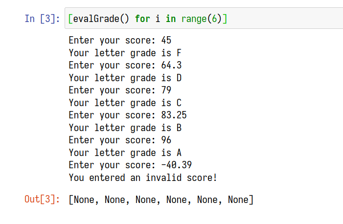
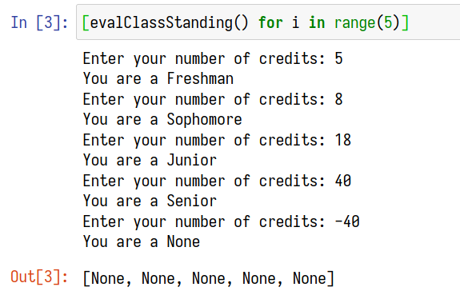
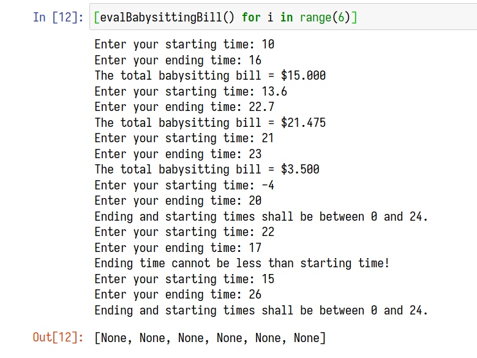

# MEG304 基於Python的資訊素養入門 HW1

> | Class       | Name  | ID                 |
> | ---             | ----       | ---                 |
> | 四資管四 | 王浚科 | B10709028 |
>
> > Date : 2021-10-30

## Q1 Exercise 2.3-2.7
### Code
> 實做
[Source Code](CODE/MEG304-B10709028-HW1-Q1.py)
```python
def Exercise23a():
    i: int = 0
    while (i <= 100):
        # Pretty Print
        if (((i+1) % 10) == 0):
            print(f"{i:>3}")
        else:
            print(f"{i:>3}", end=" ")
        i = i + 1
        
def Exercise23b():
    i: int = 0
    while (i <= 100):
        # Pretty Print
        if ((i % 7) == 0):
            print(i, end=" ")
        i = i + 1
        
def Exercise25():
    numberFound: int = 0
    x: int = 11
    while (numberFound < 20):
        if (((x % 5) == 0) and ((x % 7) == 0) and ((x % 11) == 0)):
            # Pretty Print
            if (((numberFound + 1) % 10) == 0):
                print(f"{x:<4}")
            else:
                print(f"{x:<4}", end=" ")
            numberFound = numberFound + 1
        x = x + 1
        
def Exercise26():
    numberFound: int = 0
    i: int = 10
    while (numberFound < 1):
        if (((i % 7) == 0) and ((i % 8) == 0)
                and ((i % 9) == 0) and ((i % 10) == 0)):
            print(i)
            numberFound = numberFound + 1
        i = i + 1
        
def Exercise27():
    numberFound: int = 0
    i: int = 103
    print(f"{i:>4}", end=" ")
    while (i != 1):
        numberFound = numberFound + 1
        if ((i % 2) == 0):
            i = i // 2
        elif ((i % 2) == 1):
            i = 3 * i + 1
        # Pretty Print
        if (((numberFound + 1) % 8) == 0):
            print(f"{i:>4}")
        else:
            print(f"{i:>4}", end=" ")

    # More Code in "Source Code" Link file.
```

### Output


## Q2 Prime From Py2 to Py3
### Code
> 除了 Print statement 改為 function 之外，也用了 f-string
[Source Code](CODE/MEG304-B10709028-HW1-Q2.ipynb)

```python
def SieveOfEratosthenes(n):
    prime = [True for i in range(n + 1)]
    p = 2

    while (p * p <= n):
        if (prime[p] == True):
            for i in range(p * 2, n + 1, p):
                prime[i] = False
        p += 1
    prime[0] = False
    prime[1] = False
    for p in range(n + 1):
        if prime[p]:
            print(p, end=" ")
```
```python
# driver program
n = 30
print(f"Following are the prime numbers smaller than or equal to {n}")
SieveOfEratosthenes(n)
```
```python
# driver program
n = 45
print(f"Following are the prime numbers smaller than or equal to {n}")
SieveOfEratosthenes(n)
```
```python
# driver program
n = 111
print(f"Following are the prime numbers smaller than or equal to {n}")
SieveOfEratosthenes(n)
```

### Output
輸出小於30, 45 和 111的質數


## Q3 改進 TestScore
### Code
> 使用型別註釋，統一使用 float，只允許0至100之間的數字進入 List，使用 f-string 輸出有限小數點
[Source Code](CODE/MEG304-B10709028-HW1-Q3.py)

```python
import math
from typing import List
scores: List[float] = []
print("Please enter your test scores, ending the list with a -1.")
try:
    curscore: float = float(input(""))
except ValueError:
    print("That's not a score!")
while curscore != -1:
    if (0 <= curscore <= 100):
        scores.append(curscore)
    else:
        print("That's not a valid score.")
    try:
        curscore: float = float(input(""))
    except ValueError:
        print("That's not a score!")
total = 0
minimum = scores[0]
maximum = scores[0]
for i in range(len(scores)):
    total = total + scores[i]
    if scores[i] < minimum:
        minimum = scores[i]
    if scores[i] > maximum:
        maximum = scores[i]
avg = total/len(scores)
print(f"Min is {min(scores)} Max is {max(scores)} Sum is {sum(scores)}")
print(f"Min = {minimum} Max = {maximum} Avg = {total/len(scores):.2f}")
varsum = 0
for x in scores:
    varsum = varsum + ((x-avg)**2)
print(f"The standard deviation is {math.sqrt(varsum/len(scores)):.3f}")
```

### Output
輸入三種資料集




## Q4 改進 Solution

### 1. Grader
#### Code
> 使用型別註釋，可使用 int 或 float，先允許 >0 的數字，再篩選 A, B, C, D, F 等級，使用 f-string 輸出
[Source Code](CODE/MEG304-B10709028-HW1-Q4-Grader.ipynb)

```python
from typing import Union

def grade(score: Union[int, float]):
    if 90 <= score <= 100:
        return "A"
    elif 80 <= score < 90:
        return "B"
    elif 70 <= score < 80:
        return "C"
    elif 60 <= score < 70:
        return "D"
    elif 0 <= score < 60:
        return "F"
```

```python
def evalGrade():
    score: Union[int, float] = eval(input("Enter your score: "))
    if (score >= 0):
        print(f"Your letter grade is {grade(score)}")
    else:
        print("You entered an invalid score!")
```
```python
[evalGrade() for i in range(6)]
```

#### Output
輸入資料集


### 2. ClassStanding
#### Code
> 使用型別註釋，只使用 int ，只允許 int 的數字，再篩選四個等級，使用 f-string 輸出
[Source Code](CODE/MEG304-B10709028-HW1-Q4-ClassStanding.ipynb)

```python
def classStanding(credits: int):
    if 0 <= credits < 7:
        return "Freshman"
    elif 7 <= credits < 16:
        return "Sophomore"
    elif 16 <= credits < 26:
        return "Junior"
    elif credits >= 26:
        return "Senior"
```
```python
def evalClassStanding():
    try:
        c: int = int(input("Enter your number of credits: "))
    except ValueError:
        print("That's not a credit!")
    print(f"You are a {classStanding(c)}")
```

```python
[evalClassStanding() for i in range(5)]
```

#### Output
輸入資料集


### 3. BabySittingBill
#### Code
> 使用型別註釋，只使用 float，使用 f-string 輸出有限小數點
[Source Code](CODE/MEG304-B10709028-HW1-Q4-BabySittingBill.ipynb)

```python
def babysittingBill(sTime: float, eTime: float):
    # Ending time can go up to 24. Afterwards, it becomes a new day with a new bill.
    if (eTime < 0 or eTime > 24
            or sTime < 0 or sTime > 24):
        print("Ending and starting times shall be between 0 and 24.")
        return -1

    if eTime < sTime:
        print("Ending time cannot be less than starting time!")
        return -1

    if eTime <= 21:
        total_bill = (eTime - sTime) * 2.5
    else:
        total_bill = ((eTime - 21) * 1.75) + ((21 - sTime) * 2.5)

    return total_bill
```
```python
def evalBabysittingBill():
    st: float = float(input("Enter your starting time: "))
    et: float = float(input("Enter your ending time: "))

    if ((type(st) is float) and
            (type(et) is float)):
        bill = babysittingBill(st, et)
        if bill != -1:
            print(f"The total babysitting bill = ${bill:.3f}")
    else:
        print("You can only enter numerics!")
```
```python
[evalBabysittingBill() for i in range(6)]
```

#### Output
輸入資料集


## Q5 身份證字號排列組合
### 列式

#### A123456xxx => 1 * 1 + 0 * 9 + 1 * 8 + 2 * 7 + 3 * 6 + 4 * 5 + 5 * 4 + 6 * 3 + $x_1$(X1) * 2 + $x_2$(X2) * 1 + $x_3$(X3)

$x_1$ ∈ { 0 … 9 }, $x_2$ ∈ { 0 … 9 }, $x_3$ ∈ { 0 … 9 }

##### A: 2 * $x_1$ + $x_2$ + $x_3$ + 99 ≡ 0 (mod 10)
>
> A1: $x_1$ = $x_2$ = $x_3$ => 4 * $x_1$ + 99 ≡ 0 (mod 10) => 無解，因為4的倍數加上99永遠不會是10的倍數(尾數相加必需為0)
>
> A2: $x_1$ = $x_2$ ≠ $x_3$ => 3 * $x_1$ + $x_3$ + 99 ≡ 0 (mod 10)  => 唯一解 $x_1$ = $x_2$  = 7,  $x_3$ = 0
>
> A3: $x_1$ = $x_3$ ≠ $x_2$ => 3 * $x_1$ + $x_2$ + 99 ≡ 0 (mod 10)  => 唯一解 $x_1$ = $x_3$  = 7,  $x_2$ = 0
>
> A4: $x_1$  ≠  $x_2$ = $x_3$ => 2 * $x_1$ + 2 *  $x_2$ + 99 ≡ 0 (mod 10)  => 無解， 2 * $x_1$ 或 2 *  $x_2$ 尾數必需為1
>
> A5: $x_1$ ≠ $x_2$ ≠ $x_3$ => 2 * $x_1$ + $x_2$ + $x_3$ + 99 ≡ 0 (mod 10)  => 19 組解，令 $x_2$ = 1 or $x_3$ = 1，{ 0 … 9 } 皆可帶入 $x_1$


#### D10xxyyyy4 => 1 * 1 + 3 * 9 + 1 * 8 + 0 * 7 + $x_1$(X1) * 6 + $x_2$(X2) * 5 + $y_1$(y1) * 4 + $y_2$(y2) * 3 + $y_3$(y3) * 2 + $y_4$(y4) * 1 + 4

$x_1$ ∈ { 0 … 9 }, $x_2$ ∈ { 0 … 9 }, $y_1$ ∈ { 0 … 9 }, $y_2$ ∈ { 0 … 9 }, $y_3$ ∈ { 0 … 9 }, $y_4$ ∈ { 0 … 9 }

##### B: 6 * $x_1$ + 5 * $x_2$ + 4 * $y_1$ + 3 * $y_2$ + 2 * $y_3$ + $y_4$+ 40 ≡ 0 (mod 10)
>
> B1: $x_1$ = $x_2$ , $y_1$ = $y_2$ = $y_3$ = $y_4$ => 11 * $x_1$ + 10 * $y_1$ + 40 ≡ 0 (mod 10) => 10組解，當 $x_1$ = 0 時，$y_1$ ∈ { 0 … 9 }
>
> B2: $x_1$ ≠ $x_2$, $y_1$ = $y_2$ = $y_3$ = $y_4$ => 6 * $x_1$ +  5 * $x_2$ + 10 * $y_1$ + 40 ≡ 0 (mod 10) => $x_1$ 必為 0 or 5, $x_2$ 必為 { 0, 2, 4, 6, 8 }，$y_1$ ∈ { 0 … 9 }，共 2 * 5 * 10 = 100 組組合
>
> B3: $x_1$ = $x_2$, $y_1$ ≠ $y_2$ ≠ $y_3$ ≠ $y_4$ => 11 * $x_1$ + 4 * $y_1$ + 3 * $y_2$ + 2 * $y_3$ + $y_4$+ 40 ≡ 0 (mod 10)

假設 A, B 式有相同解，即 A: $x_1$ = $x_2$ = $x_3$ 和 B: $x_1$ = $x_2$ , $y_1$ = $y_2$ = $y_3$ = $y_4$，因 A1 情況無解，故假設不成立

xy = "67" 並非正確的組合 
